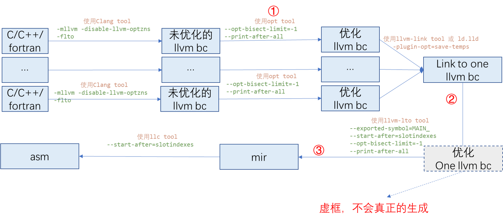

- [1. 介绍](#1-介绍)
- [2. 背景](#2-背景)
  - [2.1. llvm优化流程基本介绍](#21-llvm优化流程基本介绍)
  - [2.2. spec 跑分](#22-spec-跑分)
- [3. 方法](#3-方法)
  - [3.1. 分析①处的high-level optimization增强](#31-分析处的high-level-optimization增强)
    - [3.1.1. 方法一](#311-方法一)
    - [3.1.2. 方法二](#312-方法二)
  - [3.2. 分析②处的high-level optimization增强](#32-分析处的high-level-optimization增强)
    - [3.2.1. 方法一](#321-方法一)
    - [3.2.2. 方法二](#322-方法二)
  - [3.3. 分析low-level optimization增强](#33-分析low-level-optimization增强)
- [4. 例子：exchange\_s](#4-例子exchange_s)
## 1. 介绍
本文介绍一种分析方法：用来分析基于llvm增强的编译器(如毕昇)相比于开源llvm编译器在speccpu上进行了哪些优化增强。
本分析方法基于llvm编译优化流程，具有以下特点：
1. 黑盒，不需要对编译器代码进行修改、插装
2. 具体，具体到在哪个函数、哪个优化pass、有多少优化增强(百分比)
3. 半个指导方法，我们希望能够最终得到一个方法论，用于指导分析llvm编译器的进行了哪些增强优化，这个可能能成为半个指导方法。
   
本方法需要更多的案例验证，也迫切需要各位的指正和建议，这也是本报告的初心，谢谢!

## 2. 背景
### 2.1. llvm优化流程基本介绍
llvm的中间表示流程大概如下：

```shell
c/c++/fortran -> AST -> llvm bc -> mir -> MC -> obj -> exe 
```
优化只需要关注到llvm ir和 mir即可.
- llvm bc: llvm 进行high-level optimization，机器无关的优化
- mir: llvm 进行low-level optimization，机器相关的优化

涉及到的相关tool有:
1. llc: 1 bc file -> 1 obj file, back-end optimizations (machine-dependent optimizations and code generation)
2. llvm-lto: all bc files + obj files -> 1 obj file (clang -flto), link-time optimizations, machine-dependent optimizations and code generations  
3. opt: 1 bc file -> 1 bc file, middle-end machine-independent optimizations
4. llvm-link, many *bc file -> 1 bc file, 仅链接多个bc文件到一个bc文件, 不执行优化

llvm-lto与opt、llc的区别是:
1. opt仅在llvm bc上执行high-level optimization
2. llc将llvm ir生成mir，主要在mir上执行low-level optimization
3. llvm-opt将多个bc files合并成一个，然后在llvm bc上先执行high-level optimization，然后生成mir，再执行low-level optimization


结合以上tools, llvm的从c/c++/fortran->obj的流程可以分为两类:
1. clang (c/c++/fortran  to bc translation, with minimal front-end optimizations) -> opt (customizable
middle-end optimizations for each bc file independently) -> llvm-lto (link-time optimization, machine-dependent optimizations and obj generation)
这个流程是主要流程(即-flto的流程)
1. clang (c/c++/fortran  to bc translation, with minimal front-end optimizations) -> opt (customizable
middle-end optimizations for each bc file independently) -> llc (machine-dependent optimizations and obj generation)
非主要流程(没有-flto的流程)

### 2.2. spec 跑分
为了明确具体的优化对spec分数有多少提高，需要对修改后的可执行文件进行跑分。spec只能够按照config方式编译出来的可执行文件进行跑分，而本文涉及的混合编译很难使用config文件描述。因此，为了使得spec能够对任意方式编译的可执行文件进行跑分，需要修改runcpu perl。

在harness/benchmark.pm文件，修改build_check函数如下
```shell
sub build_check {                                                                                                       
    return 1; 
}
```
在harness/runcpu文件，注释掉如下语句
```shell
#my ($file_size, $file_sums) = read_manifests('TOOLS.sha512', 'MANIFEST');                                          
#%file_size = %{$file_size};                                                                                        
#%file_sums = %{$file_sums};                                                                                        
#check_important_files(qr#^\Q$ENV{'SPEC'}\E/bin/s[^/]+$#);
```
将可执行文件拷贝到spec2017的对应exe文件夹，运行命令如下:

```shell
runcpu --configfile clang_from_bisheng.cfg ... --runmode rate --tune base --size refrate 548 --nobuild --action=onlyrun
```

## 3. 方法


如果想要分析llvm增强编译器(如毕昇)进行了哪些优化增强，关键是了解：
1. ①处, opt增强了哪些high-level optimization
2. ②处，llvm-opt增强了哪些high-level optimization
3. ③处，llvm-lto上增强了哪些low-level optimization


### 3.1. 分析①处的high-level optimization增强
#### 3.1.1. 方法一
将问题拆解成两步:
1. 增强的llvm编译器哪些优化pass 有作用，作用多大
2. 这些优化pass在开源版本上是否起作用，作用多大

第一个问题可以快速通过`opt-bisect-limit`编译选项进行分析，通过`opt-bisect-limit`选项的二分查找，可以快速定位出哪些优化pass起作用，作用是多大
- `opt-bisect-limit`：对所有可选的优化进行编号，只允许指定编号之前的优化运行。-1 表示运行指定优化level的所有优化；0表示禁止所有可选优化；n表示禁止运行超过n的所有优化。
基本上除了除了检查类和CodeGen pass，其他high-level optimization都是可选的。

如下是一个例子：

```shell
$ opt -O2 -o test-opt.bc -opt-bisect-limit=16 test.bc

BISECT: running pass (1) Simplify the CFG on function (g)
BISECT: running pass (2) SROA on function (g)
BISECT: running pass (3) Early CSE on function (g)
BISECT: running pass (4) Infer set function attributes on module (test.ll)
BISECT: running pass (5) Interprocedural Sparse Conditional Constant Propagation on module (test.ll)
BISECT: running pass (6) Global Variable Optimizer on module (test.ll)
BISECT: running pass (7) Promote Memory to Register on function (g)
BISECT: running pass (8) Dead Argument Elimination on module (test.ll)
BISECT: running pass (9) Combine redundant instructions on function (g)
BISECT: running pass (10) Simplify the CFG on function (g)
BISECT: running pass (11) Remove unused exception handling info on SCC (<<null function>>)
BISECT: running pass (12) Function Integration/Inlining on SCC (<<null function>>)
BISECT: running pass (13) Deduce function attributes on SCC (<<null function>>)
BISECT: running pass (14) Remove unused exception handling info on SCC (f)
BISECT: running pass (15) Function Integration/Inlining on SCC (f)
BISECT: running pass (16) Deduce function attributes on SCC (f)
BISECT: NOT running pass (17) Remove unused exception handling info on SCC (g)
BISECT: NOT running pass (18) Function Integration/Inlining on SCC (g)
BISECT: NOT running pass (19) Deduce function attributes on SCC (g)
BISECT: NOT running pass (20) SROA on function (g)
BISECT: NOT running pass (21) Early CSE on function (g)
BISECT: NOT running pass (22) Speculatively execute instructions if target has divergent branches on function (g)
...
```
如果希望查看哪些优化是必选的，可以同上加上print-after-all选项，如下，凡被BISECT编号的优化都是可选的。
```shell
BISECT: running pass (4) Call-site splitting on function (brute_force_brute_)
*** IR Dump After Call-site splitting (callsite-splitting) ***
define internal void @brute_force_brute_(i64* %0, i64* nocapture readnone %1) local_unnamed_addr #0 !dbg !308 {
  %3 = alloca i32, align 4
  %4 = bitcast i64* %0 to i8*, !dbg !310
  ...
```

第二个问题可以通过混合编译实现，如果发现编号为n的pass起作用, 假设名称为A，可以通过如下方式进行验证，毕昇为例:

```shell
open_source_llvm/opt -O3 -opt-bisect-limit=n-1 test.bc -o test-opt.bc
bisheng/opt -A test-opt.bc -o test-opt.bc
open_source_llvm/opt -O3 -opt-bisect-limit=-1 test-opt.bc -o test-opt.bc
```

注意: 如果出现llvm bc 不兼容情况, 通过如下llvm-dis/llvm-as 过程或许可以缓解

```shell
# open_source_llvm bc -> bisheng llvm bc
open_source_llvm/llvm-dis test-opt.bc 
bisheng/llvm-as test-opt.ll -o test-opt.bc
```

毕昇到llvm-14在llvm bc上出现过一个较大改动，导致出现如下错误：
```
scope list must consist of MDNodes
```
即使通过llvm-dis/llvm-as，毕昇编译出来的IR在llvm 14上也无法验证通过。可以通过还原commit 8700f2bd36bb9b7d7075ed4dac0aef92b9489237:[Verifier] Verify scoped noalias metadata的修改，重新编译解决：
```
diff --git a/llvm/lib/IR/Verifier.cpp b/llvm/lib/IR/Verifier.cpp
index 444b140..641d0a7 100644
--- a/llvm/lib/IR/Verifier.cpp
+++ b/llvm/lib/IR/Verifier.cpp
@@ -4614,9 +4614,9 @@ void Verifier::visitInstruction(Instruction &I) {
     TBAAVerifyHelper.visitTBAAMetadata(I, TBAA);
 
   if (MDNode *MD = I.getMetadata(LLVMContext::MD_noalias))
-    visitAliasScopeListMetadata(MD);
+    //visitAliasScopeListMetadata(MD);
   if (MDNode *MD = I.getMetadata(LLVMContext::MD_alias_scope))
-    visitAliasScopeListMetadata(MD);
+    //visitAliasScopeListMetadata(MD);
 
   if (MDNode *AlignMD = I.getMetadata(LLVMContext::MD_align)) {
     Assert(I.getType()->isPointerTy(), "align applies only to pointer types",
@@ -5859,7 +5859,7 @@ void Verifier::verifyNoAliasScopeDecl() {
            II);
     Assert(ScopeListMD->getNumOperands() == 1,
            "!id.scope.list must point to a list with a single scope", II);
-    visitAliasScopeListMetadata(ScopeListMD);
+    //visitAliasScopeListMetadata(ScopeListMD);
   }
 
   // Only check the domination rule when requested. Once all passes have been
```

毕昇生成的IR会在flang 14上报如下错误。原因是毕昇生成的IR中包含自定义的属性`intentin`, 解决方法：
1. 手动将该属性删从IR中除然，后在flang-14中运行即可
2. 对IR 继续运行毕昇的`argpromotion`优化可消除该选项
```shell
flang-14/llvm-as: exchange2.fppized.o.bisheng240.before_opt.ll:34647:50: error: expected ')' at end of argument list
define internal void @brute_force_digits_2_(i64* intentin %row) #1 !dbg !3352 {
```


#### 3.1.2. 方法二
同样将问题拆解成两步:
1. 分析增强的llvm编译器进行了哪些优化pass
2. 将这些优化作用到开源版本上查看是否有作用，作用多大

第一个问题可以通过`-debug-pass=Arguments`编译选项获取, 如下是一个例子：
```shell
$ opt -O3 -o test-opt.bc -debug-pass=Arguments test.bc

Pass Arguments:  -tti -targetlibinfo -tbaa -scoped-noalias-aa -assumption-cache-tracker -ee-instrument -simplifycfg -domtree -sroa -early-cse -lower-expect
Pass Arguments:  -tti -targetlibinfo -tbaa -scoped-noalias-aa -assumption-cache-tracker -profile-summary-info -annotation2metadata -forceattrs -inferattrs -domtree -callsite-splitting -called-value-propagation -globalopt -domtree -mem2reg -deadargelim -domtree -basic-aa -aa -loops -lazy-branch-prob -lazy-block-freq -opt-remark-emitter -instcombine -postdomtree -sink -simplifycfg -basiccg -globals-aa -prune-eh -inline -openmpopt -function-attrs -argpromotion -domtree -sroa -basic-aa -aa -memoryssa -early-cse-memssa -aa -lazy-value-info -jump-threading -loops -scalar-evolution -correlated-propagation -simplifycfg -domtree -aggressive-instcombine -basic-aa -aa -loops -lazy-branch-prob -lazy-block-freq -opt-remark-emitter -instcombine -libcalls-shrinkwrap -loops -scalar-evolution -postdomtree -branch-prob -block-freq -lazy-branch-prob -lazy-block-freq -opt-remark-emitter -pgo-memop-opt -basic-aa -aa -loops -lazy-branch-prob -lazy-block-freq -opt-remark-emitter -tailcallelim -simplifycfg -domtree -loops -scalar-evolution -reassociate -loop-simplify -lcssa-verification -lcssa -basic-aa -aa -scalar-evolution -loop-rotate -lazy-branch-prob -lazy-block-freq -opt-remark-emitter -instcombine -loop-simplify -lcssa-verification -lcssa -scalar-evolution -indvars -loop-deletion -da -postdomtree -lazy-branch-prob -lazy-block-freq -opt-remark-emitter -loop-interchange -loop-rotate -memoryssa -lazy-branch-prob -lazy-block-freq -licm -loop-unswitch -simplifycfg -domtree -basic-aa -aa -loops -lazy-branch-prob -lazy-block-freq -opt-remark-emitter -instcombine -loop-simplify -lcssa-verification -lcssa -scalar-evolution -loop-idiom -indvars -loop-deletion -loop-unroll -sroa -aa -mldst-motion -domtree -loops -phi-values -basic-aa -aa -memdep -lazy-branch-prob -lazy-block-freq -opt-remark-emitter -gvn -phi-values -basic-aa -aa -memdep -memcpyopt -sccp -demanded-bits -bdce -aa -lazy-branch-prob -lazy-block-freq -opt-remark-emitter -instcombine -lazy-value-info -jump-threading -loops -scalar-evolution -correlated-propagation -postdomtree -adce -basic-aa -aa -memoryssa -dse -loops -loop-simplify -lcssa-verification -lcssa -aa -scalar-evolution -lazy-branch-prob -lazy-block-freq -licm -simplifycfg -domtree -loops -scalar-evolution -reassociate -basic-aa -aa -lazy-branch-prob -lazy-block-freq -opt-remark-emitter -instcombine -barrier -basiccg -rpo-function-attrs -globalopt -globaldce -basiccg -globals-aa -ipsccp -domtree -float2int -lower-constant-intrinsics -domtree -loops -loop-simplify -lcssa-verification -lcssa -basic-aa -aa -scalar-evolution -loop-rotate -loop-accesses -lazy-branch-prob -lazy-block-freq -opt-remark-emitter -loop-distribute -scalar-evolution -basic-aa -aa -da -lazy-branch-prob -lazy-block-freq -opt-remark-emitter -loop-reuse -loop-unroll-and-jam -domtree -loops -scalar-evolution -postdomtree -branch-prob -block-freq -basic-aa -aa -loop-accesses -demanded-bits -lazy-branch-prob -lazy-block-freq -opt-remark-emitter -inject-tli-mappings -lazy-value-info -loop-vectorize -lcssa-verification -lcssa -crypto -domtree -loops -loop-simplify -scalar-evolution -basic-aa -aa -loop-accesses -lazy-branch-prob -lazy-block-freq -loop-load-elim -basic-aa -aa -lazy-branch-prob -lazy-block-freq -opt-remark-emitter -instcombine -simplifycfg -domtree -loops -scalar-evolution -basic-aa -aa -demanded-bits -lazy-branch-prob -lazy-block-freq -opt-remark-emitter -inject-tli-mappings -slp-vectorizer -scalar-evolution -vector-combine -opt-remark-emitter -instcombine -loop-simplify -lcssa-verification -lcssa -scalar-evolution -loop-unroll -lazy-branch-prob -lazy-block-freq -opt-remark-emitter -instcombine -memoryssa -loop-simplify -lcssa-verification -lcssa -scalar-evolution -lazy-branch-prob -lazy-block-freq -licm -opt-remark-emitter -transform-warning -alignment-from-assumptions -strip-dead-prototypes -globaldce -constmerge -cg-profile -domtree -loops -scalar-evolution -postdomtree -branch-prob -block-freq -loop-simplify -lcssa-verification -lcssa -basic-aa -aa -block-freq -loop-sink -lazy-branch-prob -lazy-block-freq -opt-remark-emitter -instsimplify -div-rem-pairs -simplifycfg -annotation-remarks -module-summary-analysis -write-bitcode
Pass Arguments:  -tti -assumption-cache-tracker -targetlibinfo -domtree -loops -scalar-evolution -postdomtree -branch-prob -block-freq
Pass Arguments:  -domtree -loops
...

```

第二个问题可以通过混合编译实现，将以上的优化选项，可以通过如下方式进行验证，以毕昇为例。如果起作用，那么通过二分查找获取最小起作用的优化选项。

```shell
open_source_llvm/opt -O3 -opt-bisect-limit=n-1 test.bc -o test-opt.bc
bisheng/opt -tti -targetlibinfo -tbaa -scoped-noalias-aa -assumption-cache-tracker -ee-instrument -simplifycfg -domtree -sroa -early-cse -lower-expect \
... \
-domtree -loops \
... \
test-opt.bc -o test-opt.bc
open_source_llvm/opt -O3 -opt-bisect-limit=-1 test-opt.bc -o test-opt.bc
```

### 3.2. 分析②处的high-level optimization增强

#### 3.2.1. 方法一
同样将问题拆解成如上方法一两步。第一个问题，同上：对llvm-opt  进行`opt-bisect-limit`选项的二分查找，快速定位出哪些优化pass起作用，作用是多大. 同样可以加上print-after-all选项，查看哪些选项是可选的，以及选项在IR上的作用是什么。

第二个问题，基本相同，如果发现编号为n的pass起作用, 假设名称为A，可以通过如下方式进行验证，毕昇为例:

```shell
# 使用llvm-link tool 或 ld.lld -plugin-opt=save-temps 获取未优化的One llvm bc
open_source_llvm/opt -O3 -opt-bisect-limit=n-1 one-test.bc -o one-test-opt.bc
bisheng/opt -A one-test-opt.bc -o one-test-opt.bc
open_source_llvm/llvm-lto -O3 -opt-bisect-limit=-1 one-test-opt.bc -o one-test-opt.bc
```
#### 3.2.2. 方法二
基本同如上方法二，这里不再赘述。

### 3.3. 分析low-level optimization增强
一般，常常因为low-level optimization较为成熟和晦涩，增强编译器较少对low-level optimization进行修改。当存在low-level optimization增强时，可以尝试如下方法进行分析。

同样将问题拆解成如上两步。第一个问题，同上：还是对llvm-opt  进行`opt-bisect-limit`选项的二分查找(在low-level pass上)，快速定位出哪些优化low-level pass起作用，作用是多大. 同样可以加上print-after-all选项，查看哪些选项是可选的，以及选项在IR上的作用是什么。注意，low-level optimization有不少pass是必须的，分析时需要注意。

第二个问题，如果发现编号为n的low-level pass起作用, 假设名称为A，可以通过如下方式进行验证，毕昇为例:

```shell
# 使用llvm-link tool 或 ld.lld -plugin-opt=save-temps 获取未优化的One llvm bc
bisheng/llvm-lto -O3 --exported-symbol=MAIN_ --stop-after=A one-test.bc -o one-test-opt.mir
open_source_llvm/llc -O3 --start-after=A one-test-opt.mir -o one-test-opt.s
open_source_llvm/clang -c one-test-opt.s -o one-test-opt.o
```

注意：
1. 毕昇2.3.0之后mir 进行了一次较大的改动[D97435](https://reviews.llvm.org/D97435)，导致毕昇生成的mir，高版本llvm 无法识别，请将[D97435](https://reviews.llvm.org/D97435)中对应的代码修改改回去，并重新编译高版本llvm。
2. 不是所有的low-level pass都可以中止生成mir并再被重新被编译回去。

## 4. 例子：exchange_s
本例子在
1. exchange_s已经进行digits_2函数特化、specific函数使用毕昇混合编译的基础上
2. 经过不同编译器对文件进行粗粒度的混合编译分析，初步判断出进一步的优化机会在lto的基础上
使用如上方法继续进行分析。此时，train运行时间为32.371932650s，目标毕昇运行时间为23.523520940s


分析步骤大概如下：
1. 通过 ld.lld -plugin-opt=save-temps获取未优化的链接时llvm bc:exchange2_s_classic_flang14.bin.0.0.preopt.bc
```shell
"/home/musk.li/flang-14-no-d99a83b/install/bin/flang" -Mallocatable=03 -c -O3 -flto=full -mcpu=native -Kieee -mllvm -enable-loopinterchange=true -fopenmp -Wno-return-type exchange2.fppized.f90 -o exchange2.fppized.o
"/home/musk.li/flang-14-no-d99a83b/install/bin/flang" -Mallocatable=03 -c -O3 -flto=full -mcpu=native -Kieee -mllvm -enable-loopinterchange=true -fopenmp -Wno-return-type -mllvm -debug-pass=Arguments exchange2.fppized.digits_2.f90 -o exchange2.fppized.digits_2.o
"/home/musk.li/flang-14-no-d99a83b/install/bin/ld.lld" -EL --hash-style=gnu --eh-frame-hdr -m aarch64linux -dynamic-linker /lib/ld-linux-aarch64.so.1 -o exchange2_s_classic_flang14.bin -plugin-opt=save-temps /usr/lib/gcc/aarch64-redhat-linux/4.8.5/../../../../lib64/crt1.o /usr/lib/gcc/aarch64-redhat-linux/4.8.5/../../../../lib64/crti.o /usr/lib/gcc/aarch64-redhat-linux/4.8.5/crtbegin.o -L/home/musk.li/flang-14-no-d99a83b/install/lib -L/home/musk.li/bisheng-compiler-2.3.0-aarch64-linux/lib -L/home/musk.li/flang-14-no-d99a83b/install/lib -L/usr/lib/gcc/aarch64-redhat-linux/4.8.5 -L/usr/lib/gcc/aarch64-redhat-linux/4.8.5/../../../../lib64 -L/lib/../lib64 -L/usr/lib/../lib64 -L/home/musk.li/flang-14-no-d99a83b/install/bin/../lib -L/lib -L/usr/lib -plugin-opt=mcpu=tsv110 -plugin-opt=O3 -lflangmain --build-id -rpath /home/musk.li/flang-14-no-d99a83b/install/lib -lflang -rpath /home/musk.li/bisheng-compiler-2.3.0-aarch64-linux/lib -ljemalloc -lmathlib exchange2.fppized.o exchange2.fppized.digits_2.o -rpath /home/musk.li/flang-14-no-d99a83b/install/lib -lexchange2.fppized.specific -lbishengflang -lflang -lflangrti -lpgmath -lomp -lm -lrt -lpthread -lomp -rpath /home/musk.li/flang-14-no-d99a83b/install/lib -lgcc --as-needed -lgcc_s --no-as-needed -lpthread -lc -lgcc --as-needed -lgcc_s --no-as-needed /usr/lib/gcc/aarch64-redhat-linux/4.8.5/crtend.o /usr/lib/gcc/aarch64-redhat-linux/4.8.5/../../../../lib64/crtn.o
```
1. 分析llvm-lto high-level optimization优化增强

使用方法二获取llvm-lto的high-level optimization的优化选项，经过二分查找发现是`-instcombine` 起作用，train运行时间为28.432302530s。又经分析发现，flang14的llvm-lto没有该选项, 而flang14 opt具有该选项。使用flang14 opt进行`-instcombine`优化，作用同样。

```shell
"/home/musk.li/flang-14-no-d99a83b/install/bin/flang" -Mallocatable=03 -c -O3 -flto=full -mcpu=native -Kieee -mllvm -enable-loopinterchange=true -fopenmp -Wno-return-type exchange2.fppized.f90 -o exchange2.fppized.o
"/home/musk.li/flang-14-no-d99a83b/install/bin/flang" -Mallocatable=03 -c -O3 -flto=full -mcpu=native -Kieee -mllvm -enable-loopinterchange=true -fopenmp -Wno-return-type -mllvm -debug-pass=Arguments exchange2.fppized.digits_2.f90 -o exchange2.fppized.digits_2.o
"/home/musk.li/flang-14-no-d99a83b/install/bin/ld.lld" -EL --hash-style=gnu --eh-frame-hdr -m aarch64linux -dynamic-linker /lib/ld-linux-aarch64.so.1 -o exchange2_s_classic_flang14.bin -plugin-opt=save-temps /usr/lib/gcc/aarch64-redhat-linux/4.8.5/../../../../lib64/crt1.o /usr/lib/gcc/aarch64-redhat-linux/4.8.5/../../../../lib64/crti.o /usr/lib/gcc/aarch64-redhat-linux/4.8.5/crtbegin.o -L/home/musk.li/flang-14-no-d99a83b/install/lib -L/home/musk.li/bisheng-compiler-2.3.0-aarch64-linux/lib -L/home/musk.li/flang-14-no-d99a83b/install/lib -L/usr/lib/gcc/aarch64-redhat-linux/4.8.5 -L/usr/lib/gcc/aarch64-redhat-linux/4.8.5/../../../../lib64 -L/lib/../lib64 -L/usr/lib/../lib64 -L/home/musk.li/flang-14-no-d99a83b/install/bin/../lib -L/lib -L/usr/lib -plugin-opt=mcpu=tsv110 -plugin-opt=O3 -lflangmain --build-id -rpath /home/musk.li/flang-14-no-d99a83b/install/lib -lflang -rpath /home/musk.li/bisheng-compiler-2.3.0-aarch64-linux/lib -ljemalloc -lmathlib exchange2.fppized.o exchange2.fppized.digits_2.o -rpath /home/musk.li/flang-14-no-d99a83b/install/lib -lexchange2.fppized.specific -lbishengflang -lflang -lflangrti -lpgmath -lomp -lm -lrt -lpthread -lomp -rpath /home/musk.li/flang-14-no-d99a83b/install/lib -lgcc --as-needed -lgcc_s --no-as-needed -lpthread -lc -lgcc --as-needed -lgcc_s --no-as-needed /usr/lib/gcc/aarch64-redhat-linux/4.8.5/crtend.o /usr/lib/gcc/aarch64-redhat-linux/4.8.5/../../../../lib64/crtn.o

cp exchange2_s_classic_flang14.bin.0.0.preopt.bc exchange2_s_classic_flang14.bin.0.0.preopt.opt.bc
### -instcombine work #####
"/home/musk.li/flang-14-no-d99a83b/install/bin/opt" \
-instcombine \
exchange2_s_classic_flang14.bin.0.0.preopt.opt.bc -o exchange2_s_classic_flang14.bin.0.0.preopt.opt.bc

"/home/musk.li/flang-14-no-d99a83b/install/bin/llvm-lto" -O3 --exported-symbol=MAIN_ -debug-pass=Arguments exchange2_s_classic_flang14.bin.0.0.preopt.opt.bc -o exchange2_s_classic_flang14.bin.0.0.o
"/home/musk.li/flang-14-no-d99a83b/install/bin/ld.lld" -EL --hash-style=gnu --eh-frame-hdr -m aarch64linux -dynamic-linker /lib/ld-linux-aarch64.so.1 -o exchange2_s_classic_flang14.bin -plugin-opt=save-temps /usr/lib/gcc/aarch64-redhat-linux/4.8.5/../../../../lib64/crt1.o /usr/lib/gcc/aarch64-redhat-linux/4.8.5/../../../../lib64/crti.o /usr/lib/gcc/aarch64-redhat-linux/4.8.5/crtbegin.o -L/home/musk.li/flang-14-no-d99a83b/install/lib -L/home/musk.li/bisheng-compiler-2.3.0-aarch64-linux/lib -L/home/musk.li/flang-14-no-d99a83b/install/lib -L/usr/lib/gcc/aarch64-redhat-linux/4.8.5 -L/usr/lib/gcc/aarch64-redhat-linux/4.8.5/../../../../lib64 -L/lib/../lib64 -L/usr/lib/../lib64 -L/home/musk.li/flang-14-no-d99a83b/install/bin/../lib -L/lib -L/usr/lib -plugin-opt=mcpu=tsv110 -plugin-opt=O3 -lflangmain --build-id -rpath /home/musk.li/flang-14-no-d99a83b/install/lib -lflang -rpath /home/musk.li/bisheng-compiler-2.3.0-aarch64-linux/lib -ljemalloc -lmathlib -mllvm -debug-pass=Arguments exchange2_s_classic_flang14.bin.0.0.o -rpath /home/musk.li/flang-14-no-d99a83b/install/lib -lexchange2.fppized.specific -lbishengflang -lflang -lflangrti -lpgmath -lomp -lm -lrt -lpthread -lomp -rpath /home/musk.li/flang-14-no-d99a83b/install/lib -lgcc --as-needed -lgcc_s --no-as-needed -lpthread -lc -lgcc --as-needed -lgcc_s --no-as-needed /usr/lib/gcc/aarch64-redhat-linux/4.8.5/crtend.o /usr/lib/gcc/aarch64-redhat-linux/4.8.5/../../../../lib64/crtn.o

perf stat ./exchange2_s_classic_flang14.bin 1
```

1. 分析llvm-lto low-level optimization优化增强

使用`opt-bisect-limit`和`print-after-all`可以发现, llvm-lto在high-level optimization: safe-stack后发现了, 毕昇llvm-lto进行了如下low-level optimization

```shell
...
# *** IR Dump After Live Variable Analysis (livevars) ***:
# *** IR Dump After Eliminate PHI nodes for register allocation (phi-node-elimination) ***:
# *** IR Dump After Two-Address instruction pass (twoaddressinstruction) ***:
# *** IR Dump After Slot index numbering (slotindexes) ***:
# *** IR Dump After Live Interval Analysis (liveintervals) ***:
...
```

使用`--stop-after/--start-after`混合编译(如下)，发现在twoaddressinstruction处，train时间为28.782412930s, 在slotindexes处，train时间为24.916252210s，因此合理怀疑毕昇对slotindexes进行了增强。
```shell
"/home/musk.li/bisheng-compiler-2.3.0-aarch64-linux/bin/llvm-lto" -O2 --exported-symbol=MAIN_ --stop-after=slotindexes -debug-pass=Arguments exchange2_s_classic_flang14.bin.0.0.preopt.opt.bc -o exchange2_s_classic_flang14.bin.0.0.preopt.opt.bc.bisheng.mir

"/home/musk.li/flang-14-no-d99a83b/install/bin/llc" -O3 --start-after=slotindexes -debug-pass=Arguments exchange2_s_classic_flang14.bin.0.0.preopt.opt.bc.bisheng.mir -o exchange2_s_classic_flang14.bin.0.0.preopt.opt.bc.mix.s
```

最终完整混合编译命令如下：
```shell
"/home/musk.li/flang-14-no-d99a83b/install/bin/flang" -Mallocatable=03 -c -O3 -flto=full -mcpu=native -Kieee -mllvm -enable-loopinterchange=true -fopenmp -Wno-return-type exchange2.fppized.f90 -o exchange2.fppized.o
"/home/musk.li/flang-14-no-d99a83b/install/bin/flang" -Mallocatable=03 -c -O3 -flto=full -mcpu=native -Kieee -mllvm -enable-loopinterchange=true -fopenmp -Wno-return-type -mllvm -debug-pass=Arguments exchange2.fppized.digits_2.f90 -o exchange2.fppized.digits_2.o
"/home/musk.li/flang-14-no-d99a83b/install/bin/ld.lld" -EL --hash-style=gnu --eh-frame-hdr -m aarch64linux -dynamic-linker /lib/ld-linux-aarch64.so.1 -o exchange2_s_classic_flang14.bin -plugin-opt=save-temps /usr/lib/gcc/aarch64-redhat-linux/4.8.5/../../../../lib64/crt1.o /usr/lib/gcc/aarch64-redhat-linux/4.8.5/../../../../lib64/crti.o /usr/lib/gcc/aarch64-redhat-linux/4.8.5/crtbegin.o -L/home/musk.li/flang-14-no-d99a83b/install/lib -L/home/musk.li/bisheng-compiler-2.3.0-aarch64-linux/lib -L/home/musk.li/flang-14-no-d99a83b/install/lib -L/usr/lib/gcc/aarch64-redhat-linux/4.8.5 -L/usr/lib/gcc/aarch64-redhat-linux/4.8.5/../../../../lib64 -L/lib/../lib64 -L/usr/lib/../lib64 -L/home/musk.li/flang-14-no-d99a83b/install/bin/../lib -L/lib -L/usr/lib -plugin-opt=mcpu=tsv110 -plugin-opt=O3 -lflangmain --build-id -rpath /home/musk.li/flang-14-no-d99a83b/install/lib -lflang -rpath /home/musk.li/bisheng-compiler-2.3.0-aarch64-linux/lib -ljemalloc -lmathlib exchange2.fppized.o exchange2.fppized.digits_2.o -rpath /home/musk.li/flang-14-no-d99a83b/install/lib -lexchange2.fppized.specific -lbishengflang -lflang -lflangrti -lpgmath -lomp -lm -lrt -lpthread -lomp -rpath /home/musk.li/flang-14-no-d99a83b/install/lib -lgcc --as-needed -lgcc_s --no-as-needed -lpthread -lc -lgcc --as-needed -lgcc_s --no-as-needed /usr/lib/gcc/aarch64-redhat-linux/4.8.5/crtend.o /usr/lib/gcc/aarch64-redhat-linux/4.8.5/../../../../lib64/crtn.o

cp exchange2_s_classic_flang14.bin.0.0.preopt.bc exchange2_s_classic_flang14.bin.0.0.preopt.opt.bc

"/home/musk.li/flang-14-no-d99a83b/install/bin/opt" \
-instcombine \
exchange2_s_classic_flang14.bin.0.0.preopt.opt.bc -o exchange2_s_classic_flang14.bin.0.0.preopt.opt.bc


"/home/musk.li/flang-14-no-d99a83b/install/bin/llvm-dis"  exchange2_s_classic_flang14.bin.0.0.preopt.opt.bc
"/home/musk.li/bisheng-compiler-2.3.0-aarch64-linux/bin/llvm-as" exchange2_s_classic_flang14.bin.0.0.preopt.opt.ll -o exchange2_s_classic_flang14.bin.0.0.preopt.opt.bc

"/home/musk.li/bisheng-compiler-2.3.0-aarch64-linux/bin/llvm-lto" -O2 --exported-symbol=MAIN_ --stop-after=slotindexes -debug-pass=Arguments exchange2_s_classic_flang14.bin.0.0.preopt.opt.bc -o exchange2_s_classic_flang14.bin.0.0.preopt.opt.bc.bisheng.mir

"/home/musk.li/flang-14-no-d99a83b/install/bin/llc" -O3 --start-after=slotindexes -debug-pass=Arguments exchange2_s_classic_flang14.bin.0.0.preopt.opt.bc.bisheng.mir -o exchange2_s_classic_flang14.bin.0.0.preopt.opt.bc.mix.s

"/home/musk.li/flang-14-no-d99a83b/install/bin/clang" -c -mllvm -debug-pass=Arguments  exchange2_s_classic_flang14.bin.0.0.preopt.opt.bc.mix.s -o exchange2_s_classic_flang14.bin.0.0.o
#---------------------------------------------
"/home/musk.li/flang-14-no-d99a83b/install/bin/ld.lld" -EL --hash-style=gnu --eh-frame-hdr -m aarch64linux -dynamic-linker /lib/ld-linux-aarch64.so.1 -o exchange2_s_classic_flang14.bin -plugin-opt=save-temps /usr/lib/gcc/aarch64-redhat-linux/4.8.5/../../../../lib64/crt1.o /usr/lib/gcc/aarch64-redhat-linux/4.8.5/../../../../lib64/crti.o /usr/lib/gcc/aarch64-redhat-linux/4.8.5/crtbegin.o -L/home/musk.li/flang-14-no-d99a83b/install/lib -L/home/musk.li/bisheng-compiler-2.3.0-aarch64-linux/lib -L/home/musk.li/flang-14-no-d99a83b/install/lib -L/usr/lib/gcc/aarch64-redhat-linux/4.8.5 -L/usr/lib/gcc/aarch64-redhat-linux/4.8.5/../../../../lib64 -L/lib/../lib64 -L/usr/lib/../lib64 -L/home/musk.li/flang-14-no-d99a83b/install/bin/../lib -L/lib -L/usr/lib -plugin-opt=mcpu=tsv110 -plugin-opt=O3 -lflangmain --build-id -rpath /home/musk.li/flang-14-no-d99a83b/install/lib -lflang -rpath /home/musk.li/bisheng-compiler-2.3.0-aarch64-linux/lib -ljemalloc -lmathlib -mllvm -debug-pass=Arguments exchange2_s_classic_flang14.bin.0.0.o -rpath /home/musk.li/flang-14-no-d99a83b/install/lib -lexchange2.fppized.specific -lbishengflang -lflang -lflangrti -lpgmath -lomp -lm -lrt -lpthread -lomp -rpath /home/musk.li/flang-14-no-d99a83b/install/lib -lgcc --as-needed -lgcc_s --no-as-needed -lpthread -lc -lgcc --as-needed -lgcc_s --no-as-needed /usr/lib/gcc/aarch64-redhat-linux/4.8.5/crtend.o /usr/lib/gcc/aarch64-redhat-linux/4.8.5/../../../../lib64/crtn.o

perf stat ./exchange2_s_classic_flang14.bin 1
```

最终exchange_s ref得分为:1070, 非常接近gcc目标：1090，距离毕昇还有60分差距。

https://cw.fel.cvut.cz/b182/_media/courses/b4m36esw/esw04_2019.pdf
https://llvm.org/docs/MIRLangRef.html
https://llvm.org/docs/OptBisect.html
https://lists.llvm.org/pipermail/llvm-dev/2018-January/120226.html
https://llvm.org/devmtg/2017-10/slides/Braun-Welcome%20to%20the%20Back%20End.pdf
https://llvm.org/docs/LinkTimeOptimization.html
https://www.es.ele.tue.nl/~rjordans/5LIM0/02B-Anton_Korobeynikov-backend_in_24_hours-part%201.pdf
https://llvm-hpc4-workshop.github.io/slides/Osmialowski.pdf